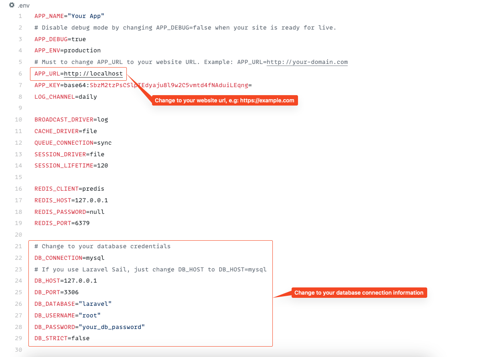
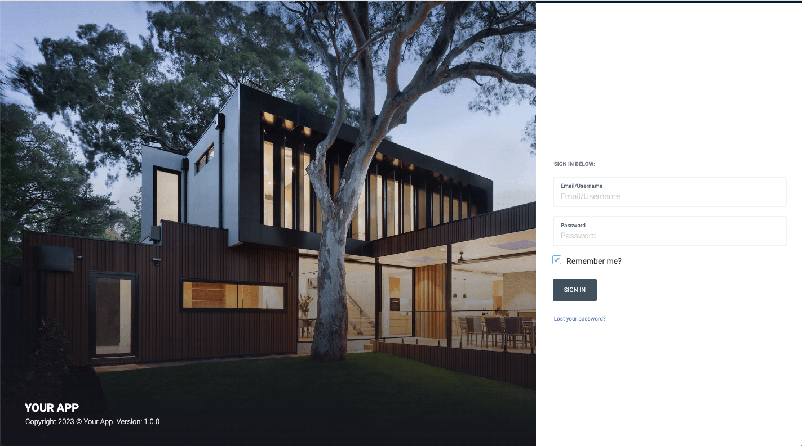

# Installation

## Requirement

Before installing **Wowy**, ensure that your server meets the following requirements:

- Apache, nginx, or another compatible web server
- PHP >= 8.0 or higher
- MySQL Database server
- `PDO` PHP extension
- `OpenSSL` PHP extension
- `mbstring` PHP extension
- `exif` PHP extension
- `fileinfo` PHP extension
- `xml` PHP extension
- `Ctype` PHP extension
- `JSON` PHP extension
- `Tokenizer` PHP extension
- `cURL` PHP extension
- Ensure the `mod_rewrite` Apache module is enabled

## PHP Configuration

Open your php configuration file `php.ini` and change the following settings.

```ini
memory_limit = 256M
max_execution_time = 300
```

If you are using cPanel, you can follow this article to change your PHP memory limit
settings https://chemicloud.com/kb/article/how-to-increase-the-php-memory-limit-in-cPanel/.

::: warning
On this project, we're using the Laravel 9.x. Please go to [Laravel documentation page](https://laravel.com/docs/9.x)
for more information.
:::

## Installing

### Install on hosting

::: tip
For Laravel developers looking to customize the source code in `platform/core` and `platform/packages`, delete
the `/vendor` folder, and then run the `composer install` command to reinstall vendor packages.
:::

#### Video tutorial

**Wowy** is based on our **Botble CMS**, check this video to see how to install it on hosting.

<iframe width="100%" height="400" src="https://www.youtube.com/embed/zFbWYpjuFJk" title="YouTube video player" frameborder="0" allow="accelerometer; autoplay; clipboard-write; encrypted-media; gyroscope; picture-in-picture; web-share" allowfullscreen></iframe>

- Upload all files into the root folder of your hosting (normally, it is`public_html`).
- Create a database and import data from `database.sql` (it's located in source code).
  
- Update your database credentials and `APP_URL` in `.env`.
  
- Go to `/admin` to access to admin panel.
- The default admin account is `botble` - `159357`.
  

### Install Locally or on a VPS

1. Update your database credentials and `APP_URL` in `.env`.

2. **Using Sample Data:**

- Import the database from `database.sql`.

3. **Without Sample Data:**

- Run `php artisan migrate` to create the database structure.
- Run `php artisan cms:user:create` to create an admin user.
- Run `php artisan cms:theme:activate wowy`.

4. **If You've Pulled Source Code from a GIT Server:**

- Run `php artisan cms:publish:assets`.

5. **Run Locally:**

- Change `APP_URL` in `.env` to `APP_URL=http://localhost:8000`.
- Run `php artisan serve`. Open `http://localhost:8000` to see the homepage.
- Access the admin panel by going to `/admin`.
- For sample data, the default admin account is `botble` with the password `159357`.
- If you're not using sample data, you need to go to **Admin** -> **Plugins** and activate all plugins.

## Configuring for Sub-Folders

::: warning
Since Wowy is based on the Laravel framework, its root folder is `/public`. If you're installing it in a sub-folder,
you'll need to access `your-domain.com/sub-folder/public`. To remove `/public` from the URL, follow the steps in
the [provided video tutorial](https://youtu.be/XdAYETd04iA).
:::

<iframe width="100%" height="400" src="https://www.youtube.com/embed/XdAYETd04iA" title="YouTube video player" frameborder="0" allow="accelerometer; autoplay; clipboard-write; encrypted-media; gyroscope; picture-in-picture; web-share" allowfullscreen></iframe>

## Setting Up Cron Jobs

A cron job is used to automatically send abandoned cart emails every week. You can skip this step if this feature isn't
needed.

```bash
* * * * * /usr/local/bin/php /path-to-your-project/artisan schedule:run >> /dev/null 2>&1
```

For setting up a cron job in cPanel, watch this [video tutorial](https://youtu.be/t5mjWGegE-g).
