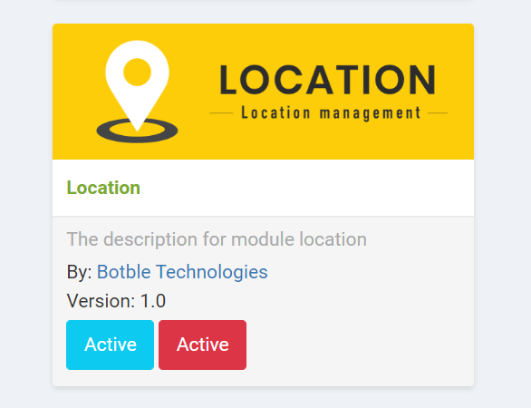
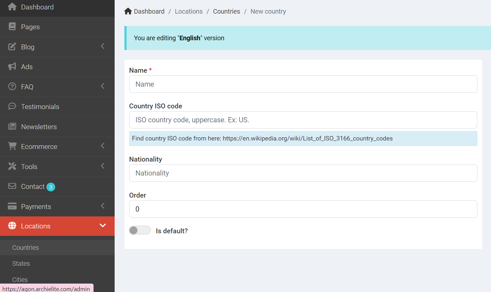
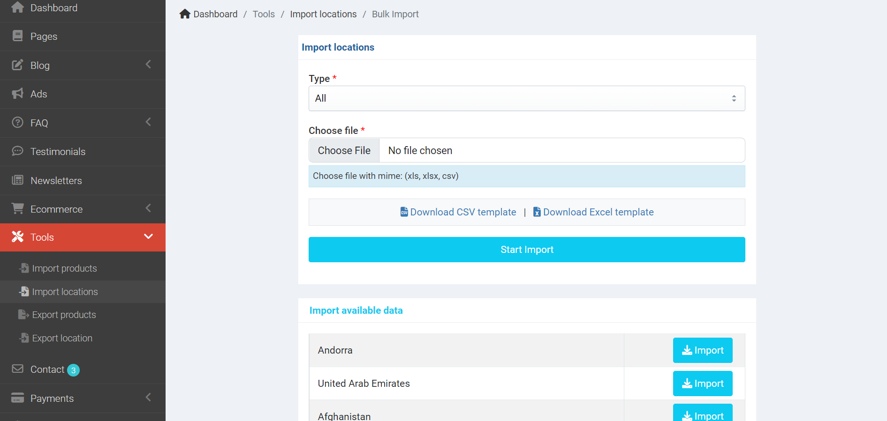
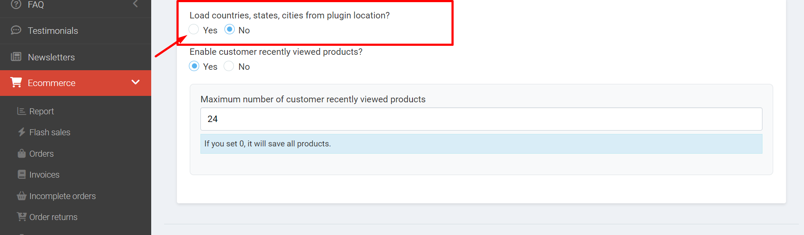

# Location

It is used to change city & state field in the checkout page to dropdown list.

## Active plugin

Go to `Admin`, find the **Location** plugin, and click **Active**.

## Add countries, states, cities

You can add manually from `Admin` -> `Locations`.

Or you can import from CSV in `Admin` -> `Tools` -> `Import locations`

## Enable to use

Go to `Admin` -> `Ecommerce` -> `Advanced Settings` and enable **Load countries, states, cities from plugin location?**

