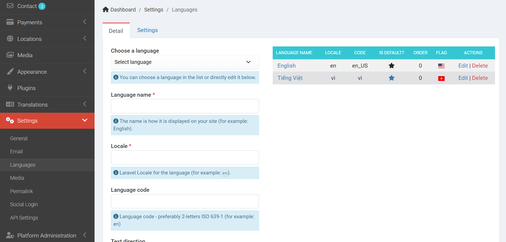
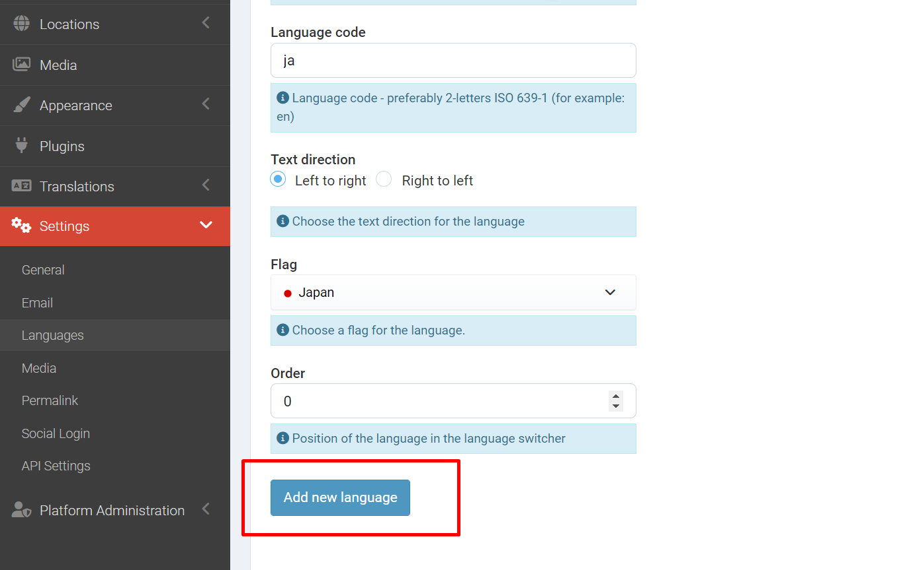
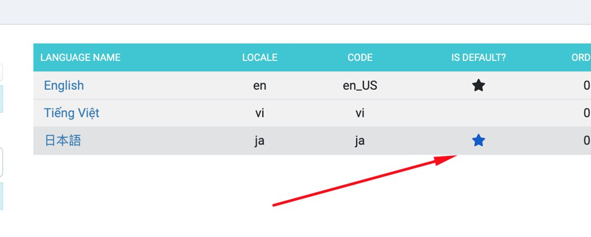
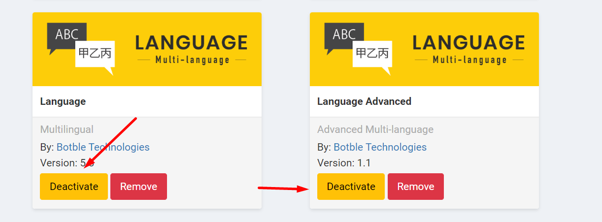

# Multi-language

## Setup languages

Go to `Admin` -> `Settings` -> `Languages`

## Change default language

Example: Change default language to `Japanese`.

First, you need to add `Spanish` language in `Admin` -> `Settings` -> `Languages`.

After that, just click on the button **Is default?** column to make `Japanese` language as default.

## Disable multi-language

Go to `Admin` -> `Plugins` -> find `Language` and `Language Advanced` plugins and disable them.

