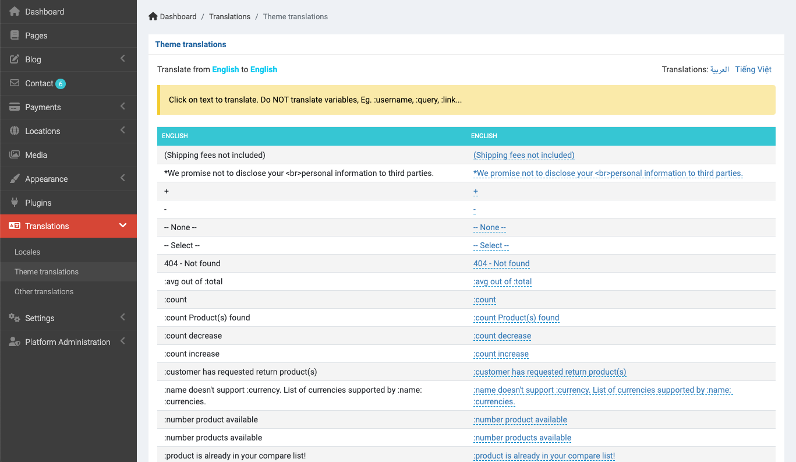
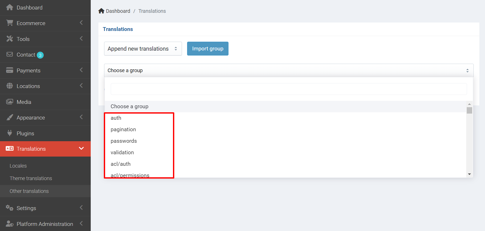

# Translation

## Add your language

Go to `Admin` -> `Settings` -> `Languages`

## Translate theme

Go to `Admin` -> `Translation` -> `Theme translations`

Click to your language on the right side to translate it to your language.

## Other translations

Go to `Admin` -> `Translation` -> `Other translations`

Select a group to start translate.

::: tip
If you don't see any group in the select box, you need to import them by choose **Append new translations** and click to the **Import** button.
:::
